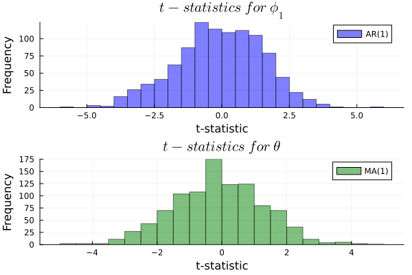
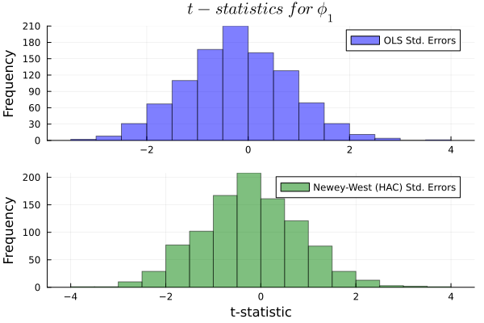

# Estimation and Confidence Intervals for AR and MA processes
### Pareto Deficient (CPequeno)

***

<br>

## Introduction

The following code simulates confidence intervals and statistical estimates for the parameters of two time series models: AR(1) and MA(1). This process is repeated over 1000 iterations (N=1000). Since AR processes exhibit autocorrelation, I compute Newey-West HAC standard errors to adjust for the loss of information compared to the iid case. As a result, this adjustment leads to higher standard errors, which in turn results in wider confidence intervals.

## Setup

As usual, I import the required packages:


```julia
using BenchmarkTools
using LaTeXStrings
using Random
using Distributions
using DataFrames
using GLM
using StatsBase
using Statistics
using Plots
```

The number of simulations is 1000 and the sample size is 500.


```julia
N = 1000
T = 500
```

### Simulation of AR(1) and MA(1) processes and computation of statistics

I create the vectors to store various statistics. In particular, the t-statistics for the hypothesis that the estimated coefficients are equal to zero; the t-statistics for the hypothesis that the estimated coefficients are equal to their true parameter values used in data generation; and the vectors that store the estimated coefficients for each simulation. I explain in the code what vector stores what.


```julia
tc1vs0 = zeros(N) # t-statistic for the intercept term (c) in the AR(1) model.
tphi1vs0 = zeros(N) # t-statistic for the autoregressive parameter (phi1) in the AR(1) model.
tc2vs0 = zeros(N) # t-statistic for the intercept term (c) in the MA(1) model.
tphi2vs0 = zeros(N) # t-statistic for the moving average parameter (theta) in the MA(1) model.

tc1 = zeros(N) # t-statistic for the intercept (c1) in the AR(1) model (testing if estimated c matches the true c1 value).
tphi1 = zeros(N) # t-statistic for the autoregressive parameter (phi1) in the AR(1) model (testing if estimated phi matches the true phi1 value).
tc2 = zeros(N) # t-statistic for the intercept (c3) in the MA(1) model (testing if estimated c matches the true c3 value).
tphi2 = zeros(N) # t-statistic for the moving average parameter (theta) in the MA(1) model (testing if estimated theta matches the true theta value).
 
c1 = zeros(N) # Estimated intercept for the AR(1) model (c).
phi1 = zeros(N) # Estimated autoregressive parameter for the AR(1) model (phi1).
c2 = zeros(N) # Estimated intercept for the MA(1) model (c).
phi2 = zeros(N) # Estimated moving average parameter for the MA(1) model (theta).
```

Now, I run 1000 simulations of the aforementioned models. First of all, the code generates the data for the following AR(1) process:

$$
y_t = 1 + 0.2y_{t-1} + \epsilon_t
$$

The first value of $y_1$ is the intercept, called 'c1_val' plus a realization of epsilon, 'randn()', which follows a standard normal variable. This is necessary because the model need an initial value to start with. Once the initial value for $t=1$ is given, it is easy to get $y_2$ as $y_2 = 1 + y_1 + \epsilon$ for $t=2$ and so on and so forth.

Next, the loop estimates an AR(1) model. 'X1' is a matrix with a column of ones (the intercept) and a column for the lagged values of $y_t$ for $t = {2, ..., T}$, which is defined as 'y1_endog'. (Recall: $y_1$ is given.)

Thus, $\hat{\beta_1} = (\hat{c_1}, \hat{\phi_1})$ is calculated, as usual, by least squares:

$$
\boldsymbol{\hat{\beta_1}} = (\mathbf{X_1}^\top \mathbf{X_1})^{-1} \mathbf{X_1}^\top \mathbf{y_{1}}
$$

Finally, statistics for the AR(1) model are calculated and stored in the vectors created above. Also, similar steps are followed to create, estimate and compute the statistics

$$
\boldsymbol{\hat{\beta_2}} = (\mathbf{X_2}^\top \mathbf{X_2})^{-1} \mathbf{X_2}^\top \mathbf{y_{2}}
$$

where $\hat{\beta_2} = (\hat{c_2}, \hat{\theta})$, for the following MA(1) model:

$$
y_t = 1 + \epsilon_t + 0.2 \epsilon_{t-1}.
$$


```julia
Random.seed!(123)

for i = 1:N

    # Generate AR(1) data
    c1_val = 1
    phi = 0.2
    y1 = c1_val .+ randn(T)
    
    for t in 2:T
        y1[t] = c1_val + phi * y1[t-1] + randn()
    end

    # Estimate AR(1)
    X1 = hcat(ones(T-1), y1[1:T-1])
    y1_endog = y1[2:T]
    β1 = inv(X1' * X1) * X1' * y1_endog
          
    # Compute Statistics for AR(1)
    residuals1 = y1_endog - X1 * β1
    mse1 = sqrt(sum(residuals1.^2) / (T-2))
    se1 = mse1 / sqrt(sum(y1[1:T-1].^2))
    tc1[i] = (β1[1] - c1_val) / se1
    tphi1[i] = (β1[2] - phi) / se1
    c1[i] = β1[1]
    phi1[i] = β1[2]

    # Generate MA(1) Data
    c2_val = 1
    theta = 0.2
    e = randn(T)
    y2 = c2_val .+ e .+ theta .* vcat(0, e[1:T-1])
    
    # Estimate MA(1)
    X2 = hcat(ones(T-1), e[1:T-1])
    y2_endog = y2[2:T]
    β2 = inv(X2' * X2) * X2' * y2_endog
    
    # Compute Statistics for MA(1)
    residuals2 = y2_endog - X2 * β2
    mse2 = sqrt(sum(residuals2.^2) / (T-2))
    se2 = mse2 / sqrt(sum(y2[1:T-1].^2))
    tc2[i] = (β2[1] - c2_val) / se2
    tphi2[i] = (β2[2] - theta) / se2
    c2[i] = β2[1]
    phi2[i] = β2[2]
end
```

In summary, the code generates simulated data for AR(1) and MA(1) models using their respective formulas. Then, it estimates the parameters using OLS for each one. Next, it computes t-statistics to evaluate the accuracy of the estimated parameters. And, finally, it stores results (coefficients and t-statistics) in vectors.

Since I am working with stochastic processes, it is important to set a seed to ensure replicability. Although these notebooks are intended for educational purposes, setting a seed demonstrates good research practice. It also helps prevent potential issues if you decide to replicate my results (though I'm not sure why you'd want to!). In any case, everyone wins by planting a seed!

### Confidence intervals for $\phi_1$ and $\theta$

Now, I plot the t-statistics for the two models:




The t-statistics are centered around 0, which suggests that the estimated coefficients, $\hat{\phi_1}$, $\hat{\phi_2}$, and $\hat{\theta}$ from the models are generally close to the true parameters, i.e., $\phi_1$ and $\theta$, because

$$
t = \frac{\hat{\gamma} - \gamma}{SE(\hat{\gamma})}
$$

where $\hat{\gamma} = (\hat{\phi_1}, \hat{\theta})$ and $\gamma_0 = (\phi_1, \theta)$.

This means that the model specifications are appropriate, so they are estimating the actual true data generating process (DGP). However, as said in other notebooks, t-test is not very appropriate if independence and homoskedasticity assumptions on the errors do not hold. Methods like the Newey-West or robust standard errors can be used to correct for autocorrelation and heteroskedasticity when testing hypotheses about model parameters. Here, I focus on Newey-West standard errors.

### Newey-West HAC standard errors


```julia
cl = 0.95
q = quantile(Normal(0, 1), (1 + cl) / 2)
```


```julia
ciols = zeros(Int, N)
ciolsnw = zeros(Int, N)
t_stat_ols = zeros(Float64, N)
t_stat_nw = zeros(Float64, N)
```

Let me define a matrix, $X$, of dimensions $n \times k$. Consider, for illustration purposes, a model such that $Y = X\beta + \epsilon$. The variance-covariance matrix, in case of heteroskedasticity and autocorrelation, is no longer

$$
\text{Var}(\hat{\beta}) = \sigma^2 \left( X^\top X \right)^{-1},
$$

but

$$
\text{Var}(\hat{\beta}) = \left( X^\top X \right)^{-1} \hat{\Omega} \left( X^\top X \right)^{-1}.
$$

where $\hat{\Omega} = S_0 + S_l$, $S_0 = \frac{1}{n} \sum_{t=1}^{n} \epsilon_t^2 X_t X_t^\top$, $S_l = \frac{1}{n} \sum_{t=1}^{n-l} \omega_t \epsilon_t \epsilon_{t+l} X_t X_{t+l}^\top$, $w_l = 1 - \frac{l}{L+1}$.

In the code below, I translate the mathematical formulation into code. Note that both variance-covariance matrices are similar to the usual variance which does not assume homoskedasticity, i.e.,

$$
\text{Var}(\hat{\beta}) = \left( X^\top X \right)^{-1} X'\hat{\Sigma} X\left( X^\top X \right)^{-1}.
$$
where $\Sigma = \epsilon^\top \epsilon$, but the Newey-West matrix also include a term which takes into account the autocorrelation of the model.


```julia
function newey_west_se(X, residuals, max_lag)
    n, k = size(X)

    S0 = zeros(k, k)
    Sl = zeros(k, k)

    for t in 1:n
        S0 += residuals[t]^2 * (X[t, :] * X[t, :]')
    end

    # Lagged covariances
    for l in 1:max_lag
        weight = 1 - l / max_lag  # Corrected weight formula

        for t in 1:(n - l)
            Sl += weight * residuals[t] * residuals[t + l] * (X[t, :] * X[t + l, :]')
        end
    end

    omega = S0 + Sl + Sl'

    V = inv(X' * X) * omega * inv(X' * X)
    
    return sqrt.(diag(V))
end
```

```
## newey_west_se (generic function with 1 method)
```

### Confidence interval for $\phi_1$ using Newey-West HAC standard errors

As before, I compute the coverage ratios and the t-test statistics for $\phi = 0.8$ in the following AR(1) process:

$$
y_t = 0.8y_{t-1} + \epsilon_t.
$$

Similarly, the code below simulate the AR(1) process and compute the homoskedastic and Newey-West standard errors, as well as the CIs and the t-statistics.


```julia
Random.seed!(1234)

for i in 1:N
    phi = 0.8

    y = zeros(Float64, T)
    y[1] = rand(Normal(0, 1))

    for t in 2:T
        y[t] = phi * y[t - 1] + rand(Normal(0, 1))
    end

    X = hcat(ones(T-1), y[1:T-1])
    y_endog = y[2:T]
    
    # Homoskedastic standard errors
    b_ols = inv(X' * X) * X' * y_endog
    res_ols = y_endog - X * b_ols
    mse = sum(res_ols.^2) / (T - 1)
    cov_b_ols = mse * inv(transpose(X) * X)
    se_ols = sqrt(cov_b_ols[2, 2])

    # Confidence interval with homoskedastic standard errors
    ci_ols_low = b_ols[2] - q * se_ols
    ci_ols_high = b_ols[2] + q * se_ols
    ciols[i] = (ci_ols_low < phi && ci_ols_high > phi) ? 1 : 0
    t_stat_ols[i] = (b_ols[2] - phi) / se_ols

    # Newey-West standard errors
    L = floor(Int, 4 * (T / 100)^(2 / 9))
    se_olsnw = newey_west_se(X, res_ols, L)[2]

    # Confidence interval with Newey-West standard errors
    ci_olsnw_low = b_ols[2] - q * se_olsnw
    ci_olsnw_high = b_ols[2] + q * se_olsnw
    ciolsnw[i] = (ci_olsnw_low < phi && ci_olsnw_high > phi) ? 1 : 0
    t_stat_nw[i] = (b_ols[2] - phi) / se_olsnw
end
```


```julia
ols_coverage = mean(ciols)
```

```
## 0.933
```

```julia
olsnw_coverage = mean(ciolsnw)
```

```
## 0.938
```

Note the similar coverage for both homoskedastic and Newey-West robust to heteroscedasticity and autocovariance (HAC) standard errors, with a slight advantage for the second ones. These results are reasonable given the structure of the AR(1) model and the large sample size. The Newey-West correction provides minimal benefit when there is no significant heteroscedasticity (i.e., errors are still white noise) or higher-order autocorrelation. As a result, confidence intervals and coverage rates are nearly identical. However, we should expect that, in general, the Newey-West (HAC) standard errors will be larger (smaller) than the homoscedastic ones due to their correction for potential positive (negative) autocovariance. The intuition is that there is less information to exploit (today's information is mostly the same as yesterday's), so the variance, which is somewhat the inverse of the available information, is larger.




As can be seen, the CIs calculated using the Newey-West standard errors are slightly wider. There is a reason why I focused on the AR(1) parameters. Note that one caveat regarding the MA(1) model should be noted. In general (i.e. outside of these Mickey Mouse examples) it is not possible to estimate an MA(q) model for any $q$ using OLS. The reason is that the errors are not observable, so $X_3$ cannot be estimated. Other methods, such as Gauss-Newton or Hannan-Rissanen, are explored in upcoming notebooks.
