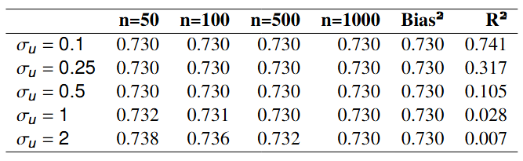
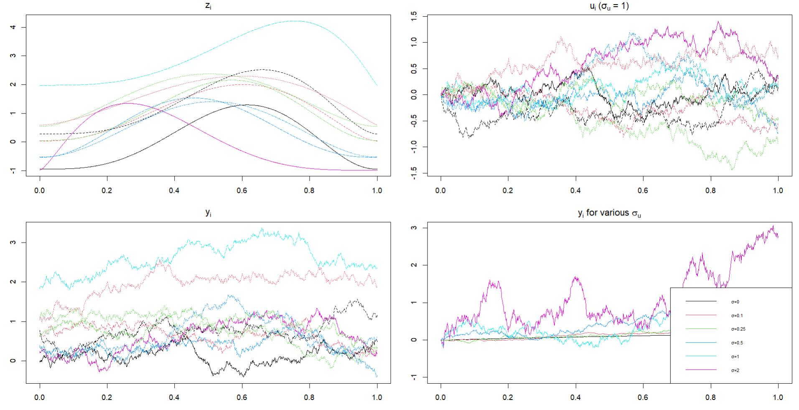

## Introduction

Consider a regression model where both the dependent, $Y$, and the independent, $Z$, variables are random functions. Let these functions depend on $t$, which may refer to time, location or whatever. For example, think about $Y_i(t)$ as the electricity consumption in Madrid on day $i$ at hour $t$ and $Z_i(t)$ as the average temperature in Madrid on day $i$ at hour $t$. The problem with traditional multivariate regression approaches (e.g., OLS) is that, in such a setting, usually $Z_i \in \mathbb{R}^{73}$, which leads to inverting a $73 \times 73$ matrix — often ill-conditioned. This problem worsens as data becomes more frequent, observations are highly correlated, and dimensionality increases.

Functional linear regression offers a natural solution by treating predictors as continuous functions rather than high-dimensional vectors. Instead of modeling relationships between finite-dimensional vectors, it models the relationship between functions and responses, typically assuming some degree of smoothness in the functional predictors. This reduces the effective dimensionality of the problem, mitigates multicollinearity issues, and can improve estimation and prediction accuracy, particularly when the underlying data are densely observed and smooth in nature.

The functional response, $Y$, and the functional regressor, $Z$, are assumed to belong to separable Hilbert (that is, infinite) spaces. In particular, $Y \in \mathcal{E}$ and $Z \in \mathcal{F}$, where both $\mathcal{E}$ and $\mathcal{F}$ are equipped with potential different inner products, which lets us identify every continuous linear functional (i.e.each regression coefficient) via Riesz’s representation theorem (see below). For those not acquainted with real analysis, the reason for working in a Hilbert space is that these spaces allow us to treat functions—viewed as infinite -dimensional curves— as data objects (vectors), enabling us to add them, scale them, and measure their size or 'distance'.


## The Model

Consider the following model:

$$
Y = \Pi Z + U
$$

where $U$ is a zero mean random element of the $\mathcal{E}$ and $\Pi$ is a non random Hilbert-Schmidt operator from $\mathcal{F}$ to $\mathcal{E}$; Z is assumed to be exogenous; and $cov(Z, U) = 0$.

To understand what a Hilbert-Schmidt (HS) operator is, we need to understand before what an operator is. So let's proceed by parts like Jack the Ripper. An operator is basically a map between functions. Formally, an operator is a mapping

$$
T: Z \to Y
$$

that assigns to each element $z \in \mathcal{F}$ a unique element $T(x) \in \mathcal{E}$. More specifically, we care about linear operators, which are operators that satisfies $T(\alpha z + \beta x) = \alpha T(z) + \beta T(x)$ for all $z, x \in \mathcal{F},\ \alpha, \beta \in \mathbb{R}$. Even more, a linear bounded operator is an operator which also satisfies that $\|T(z)\|_E \leq C \|z\|_F$ for all $z \in \mathcal{F}$. (Important: under linearity, boundedness is equivalent to continuity.) Finally, a Hilbert-Schmidt operator is a bounded linear operator that is compact and can be approximated by finite-rank operators (see below for details). This property is particularly valuable, as we are working with infinite-dimensional curves, and approximating them using a finite basis is very advantageous in practice. In fact, this is the heart of functional data analysis.

In functional linear regression, the goal is to find a linear functional $L$ (that is, an operator whose codomain is $\mathbb{R}$) such that, for $z \in \mathcal{F}$, $E[Y \mid Z = z] = L(z)$. In plain English, that the prediction of $Y$ given the curve $Z=z$ is linear in $z$. By assuming continuity and given that $\mathcal{F}$ is a Hilbert space, the Riesz representer theorem applies. This theorem states that, under these assumptions, there is an unique element $\widehat{\Pi} \in \mathcal{F}$ such that

$$
L(z) = \langle z, \widehat{\Pi} \rangle, \quad \forall z \in \mathcal{F}
$$

In other words, every continuous linear functional can be written as as an inner product with a fixed representer $\widehat{\Pi}$. That representer $\widehat{\Pi}$ is the regression “coefficient” in functional linear regression.


## Analytical Derivation

### Defining the Estimator

Define the covariance operator of $Z$ as:

$$
V_Z: \mathcal{F} \rightarrow \mathcal{F}, \quad V_Z \phi = \mathbb{E}[Z \langle Z, \phi \rangle]
$$

and the covariance operator of $(Y, Z)$ as:

$$
C_{YZ}: \mathcal{F} \rightarrow \mathcal{E}, \quad C_{YZ} \phi = \mathbb{E}[Y \langle Z, \phi \rangle].
$$

Then, using the model relationships, we end up with the following result:

$$
C_{YZ} = Cov(\Pi Z + U, Z) = \Pi Cov(Z, Z) + Cov(U, Z) = \Pi V_Z
$$

and

$$
C_{ZY} = V_Z \Pi^*
$$

where $\Pi^*$ is the adjoint of $\Pi$ and $C_{ZY}$ is the covariance operator from $\mathcal{E}$ to $\mathcal{F}$. After minimizing MSE, and by analogy with normal equations from OLS, we could be tempted to define the estimator of $\Pi$ as:

$$
\widehat{\Pi}^* = \widehat{V_Z^{-1}}\widehat{C_{ZY}}.
$$

However, recall $V_Z \in \mathbb{F}$ is compact, so $V_Z(e_j) = \lambda_j e_j$ with $\lambda_j \rightarrow 0$ as $j \rightarrow \infty$. This implies $V_Z^{-1}(e_j) = \frac{1}{\lambda_j}e_j \rightarrow \infty$, where $e_j$ is an orthonormal base. Hence, $V_Z$ is not invertible in the entire space $\mathcal{E}$. Also, generalized inverse does not help here because it is not continuous. Hence, we need to add some regularization term (similar to Ridge) to avoid singularity. In particular, Benatia, Carrasco and Florens (2017) use Tikhonov Regularization:

$$
\widehat{\Pi_\alpha} = \widehat{C_{YZ}} \left( \alpha I + \widehat{V_Z} \right)^{-1}
and \quad \widehat{\Pi^*_\alpha} = (\alpha I + V_Z)^{-1} \widehat{C_{ZY}}
$$

where $\alpha > 0$ is the regularization parameter and $\widehat{C}_{YZ}$, and $\widehat{V}_Z$ are the empirical covariance operators.


### Computation of the Estimator

Let's start with the (infinite) "normal equations":

$$
C_{ZY} \psi = (\alpha I + V_Z) \widehat{\Pi_\alpha^*} \psi.
$$

The sample analog of these equations is given by the following expression:

$$
\frac{1}{n} \sum_{i=1}^n z_i \langle y_i, \psi \rangle = 
\alpha \widehat{\Pi_\alpha^*} \psi + \frac{1}{n} \sum_{i=1}^n z_i \langle z_i, \widehat{\Pi_\alpha^*} \psi \rangle.
$$

Given that we are working with sample counterparts, the data are effectively represented in a finite-dimensional (specifically, $n$-dimensional) space. The underlying functional objects remain infinite-dimensional though. However, by the compactness of the operator associated with the problem, we know that $\Pi$ can be well approximated using a finite number of basis functions. A natural choice for the basis could be constructed from the observed data ($z_1, ..., z_n$) or from an orthonormal basis such as eigenfunctions. Also, by the Riesz representation theorem, for a continuous linear functional $L$, there exists a unique representer $\widehat{\Pi}_{\alpha}^* \in \mathcal{F}$ such that

$$
L(z) = \langle z,  \widehat{\Pi_{\alpha}^*} \rangle, \quad \forall z \in \mathcal{F}.
$$

Thus, the conditional expectation $E[Y \mid Z = z]$ can be written as $L(z)$. Hence, for each ($s$, $t$), we end up with the following expression:

$$
\hat{\pi_{\alpha}}(s, t) = \frac{1}{n} \, y(s)' (\alpha I + M)^{-1} z(t)
$$


## Numerical Derivation

Now, we proceed to the core of this notebook: a simulation study of the estimator presented above. First of all, we construct both a pseudo-continuous interval of [0, 1], consisting of 1000 equally-spaced discrete steps and a discretized interval of [0, 1] consisting of only 100 equally-spaced discrete steps:


``` r
library(MASS)
library(fields)
library(fda)
library(xtable)
```


``` r
set.seed(123) # Seed for reproducibility.
```


``` r
T_cont <- seq(0,1,length=1000) # This is the "fine grid" used to simulate the actual, smooth functions. Obviously, we cannot represent continuous data in a computer, but think about this dense grid as an infinity number of points.

T_disc <- seq(0,1,length=100) # This is the "coarse grid", which represents the (finite) observed data.

idx <- round(seq(1,1000,length=100)) # This index is used to select a subset of points of T_cont that matches T_disc.

Δ_cont  <- diff(T_cont)[1]
Δ_disc  <- diff(T_disc)[1]
```

The observed discrete points, $T_disc$, are assumed to arise from an underlying (quasi-)continuous process, $T_cont$. To construct the sample distributions, we treat the quasi-continuous distributions as the true data-generating processes (DGPs) and sample from them accordingly. From this point onward, we refer to the quasi-continuous distribution as the true distribution for simplicity, although it is important to remember that the actual underlying distribution is continuous, not quasi-continuous.

Let $\Pi$ to be an integral operator from $\mathcal{F} = L^2[0, 1]$ to $\mathcal{E} = L^2[0, 1]$, with kernel $\pi(s,t) = 1 - |s - t|^2$. Given so, we create the true operator using the (quasi)continuous data and then we extract the observed, discretized version.


``` r
pi_true_fine <- outer(T_cont, T_cont, function(s,t) 1 - (abs(s-t))^2)
pi_true_disc <- pi_true_fine[idx, idx] # Dimension: 100 x 100
```

The choice of such a kernel is motivated by its desirable theoretical properties in a regression context, such as positive definiteness.

Also, we set the regularization parameter, $\alpha$, at 0.01:


``` r
alpha <- 0.01
```

The error function is assumed to follow an Ornstein–Uhlenbeck process with zero mean and means reversion rate equal to one:


``` r
simulate_OU <- function(sdu, grid) {
  n <- length(grid)
  u <- numeric(n)
  dt <- diff(grid)[1]
  for(i in 2:n) {
    u[i] <- u[i-1] - u[i-1]*dt + sdu*sqrt(dt)*rnorm(1)
  }
  return(u)
}
```

This distribution is perfect for such a setting because it guarantees the error function to be (1) smooth but with random fluctuations; (2) stationary; and (3) correlated.

Finally, we consider the functional regressor to follow the following distribution: 

$$
Z_i(t) = \frac{\Gamma(\alpha_i + \beta_i)}{\Gamma(\alpha_i) \Gamma(\beta_i)} t^{\alpha_i - 1} (1 - t)^{\beta_i - 1} + \eta_i,
$$

for $t \in [0, 1]$, where $\alpha_i, \beta_i \sim \text{iid} \, U[2, 5]$ and $\eta_i \sim \text{iid} \, N(0, 1)$ for all $i = 1, \dots, n$. The reason for such a distribution is that, unlike Gaussian distribution, the Beta distribution is bounded (as it has support only on the interval $[0, 1]$).

Based on this, we can compute the estimated $100 \times 100$ matrix $\Pi$ using the following algorithm:


``` r
estimate_pi <- function(n, sdu) {
  
  Zi <- matrix(0, n, length(T_cont)) # Dimension: n x 1000
  for(i in 1:n){
    a <- runif(1,2,5);  b <- runif(1,2,5)
    Zi[i,] <- dbeta(T_cont, a, b)
  }
  
  Z  <- Zi[, idx] # Dimension: n x 100
  
  Yi_sig_fine <- (pi_true_fine %*% t(Zi)) * Δ_cont # Dimension: 1000 x n
  Yi_sig <- t(Yi_sig_fine)[, idx] # Dimension: n x 100
  
  Ui <- t(sapply(1:n, function(i) simulate_OU(sdu, T_disc)))
  Y <- Yi_sig + Ui # n x 100
  
  CZY  <- crossprod(Y, Z) / n # Dimension: 100 x 100
  KZZ  <- crossprod(Z, Z) / n # Dimension: 100 x 100
  
  phat <- CZY %*% solve(KZZ + alpha * diag(100))
  return(phat) # Dimension: 100 x 100
}
```

Once we computed the estimator, we can obtain the squared bias, and the $R^2$, and the MSE for each ($\sigma_u$, $n$). These results are shown below:


``` r
n_bias <- 1000
R_bias <- 100

sdus <- c(0.1,0.25,0.5,1,2)

bias2 <- sapply(sdus, function(sdu){
  phis <- replicate(R_bias,
                    estimate_pi(n_bias, sdu),
                    simplify="array") # Instead of getting a list of 100 matrices of...
                                      # dimension 100 x 100, we get a 3D array.
                                      # Thus, for each (s, t), we have 100 independent...
                                      # draws of pi.
  
  pi_mean <- apply(phis, c(1,2), mean) # Apply mean over each (s, t) observation.
  
  sum((pi_mean - pi_true_disc)^2) * (Δ_disc^2)
})
```


``` r
n_R2     <- 1000
Z_fine  <- matrix(0, n_R2, length(T_cont))

for(i in 1:n_R2){
  a <- runif(1,2,5);  b <- runif(1,2,5)
  Z_fine[i,] <- dbeta(T_cont, a, b)
}

Y_fine <- (pi_true_fine %*% t(Z_fine)) * Δ_cont
Y <- t(Y_fine)[, idx]
var_Y <- var(as.vector(Y))

R2 <- sapply(c(0.1,0.25,0.5,1,2), function(sdu){
  U <- t(sapply(1:n_R2, function(i) simulate_OU(sdu, T_disc)))
  X <- Y + U
  var_Y / var(as.vector(X))
})
```


``` r
n_mse   <- c(50,100,500,1000)
R_mse <- 100

MSEtab <- matrix(NA, nrow=5, ncol=4,
                 dimnames=list(paste0("σu=",sdus),
                               paste0("n=",   n_mse)))

for(si in seq_along(sdus)){
  for(ni in seq_along(n_mse)){
    phats <- replicate(R_mse,
                       estimate_pi(n_mse[ni], sdus[si]),
                       simplify="array") # Dimension: 100 x 100 x R_mse
    
    # Compute the squared error over each simulation:
    errs <- apply(phats, 3, function(P){
      sum((P - pi_true_disc)^2) * (Δ_disc^2) # We extract a 100 x 100 matrix for each...
                                             # replication from 1 to R_mse.
    })
    
    # Finally, compute the mean squared error:
    MSEtab[si,ni] <- mean(errs)
  }
}

final_table <- cbind(
  MSEtab,
  `Bias²` = bias2,
  `R²` = R2
)
```


{width=60%}

On the one hand, mean-square error (MSE) decreases with sample size $n$, confirming consistency. On the other hand, MSE increases with $\sigma_u$. Also, the fixed regularization parameter precludes MSE from converging towards zero. In fact, it converges to $\| \Pi - \Pi_{\alpha} \|^2_{\text{HS}}$, which is the squared bias introduced by the regularization parameter. Finally, the coefficient of determination $R^2$ remain high for small $\sigma_u$, indicating good model fit.

Also, we plot ten discretized predictor functions (top left); Ornstein–Uhlenbeck error functions for $\sigma_u = 1$; response functions; and an example of a response function for various values of sigma_u.


``` r
n0 <- 10

Zi <- matrix(0, n0, length(T_cont))
Ui <- matrix(0, n0, length(T_cont))
Yi <- matrix(0, n0, length(T_cont))

for(i in 1:n0){
  
  a <- runif(1, 2, 5); b <- runif(1, 2, 5)
  
  Zi[i,] <- dbeta(T_cont, a, b) +  rnorm(1, 0, 1)
  
  Ui[i,] <- simulate_OU(1, T_cont)
  
  Yi[i,] <- Zi[i,] %*% pi_true_fine * (T_cont[2]-T_cont[1]) + Ui[i,]
}


par(mfrow = c(2, 2), mar = c(3, 3, 2, 1))

matplot(T_cont, t(Zi), type = "l",
        main = expression(z[i]),
        xlab = "t", ylab = "")

matplot(T_cont, t(Ui), type = "l",
        main = expression(u[i] ~ "(σ"[u]*" = 1)"),
        xlab = "t", ylab = "")

matplot(T_cont, t(Yi), type = "l",
        main = expression(y[i]),
        xlab = "t", ylab = "")

colors <- c(1:6)

sdus <- c(0,0.1,0.25,0.5,1,2)

for (sdu in sdus) {
  ytmp <- Zi[1, , drop = FALSE] %*% pi_true_fine * (T_cont[2] - T_cont[1]) +
    simulate_OU(sdu, T_cont)
  
  line_color <- colors[which(sdus == sdu)]
  
  if (sdu == sdus[1]) {
    plot(T_cont, ytmp, type = "l", col = line_color,
         main = expression(paste("y"[i], " for various ", sigma[u])),
         xlab = "t", ylab = "", ylim = c(-1, 3))
  } else {
    lines(T_cont, ytmp, col = line_color)
  }
}

legend("bottomright", legend = paste0("σ=", sdus), col = colors, lty = 1, cex = 0.6)
```

<center>**Examples of Simulated Functions**</center>


